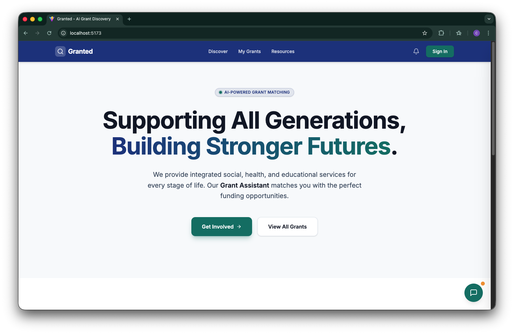

# Granted — Hackathon Project & Developer Guide



## Hackathon Project — Overview

This repository contains the Hackathon entry for "Granted": an automated grant discovery engine built to help NPOs find and act on funding opportunities.

### Inspiration

We wanted to build a system where funding finds the NPO, shifting the paradigm from "Pull" (active checking) to "Push" (proactive notification).

### Problem Statement

How might non-profit organisations "pull" information about grants from the OurSG grants portal that are relevant to them according to key criteria including issue area, scope of grant, KPIs, funding quantum, application due date, etc., so that they can strengthen their financial sustainability?

### What it does

- **Interactive Profiling**: NPOs chat with a bot that interviews them to capture mission, budget, and KPIs, converting conversational answers into a structured `Profile_JSON`.
- **Curator**: A scheduling agent sends a high-value digest that ranks opportunities using vector similarity and matching logic (including grant quantum vs. project size) and surfaces a high-confidence "Top 3".
- **Detection**: Continuous monitoring detects new grants on OurSG and pushes "Flash" notifications to matched NPOs.

### Tech Stack

- Frontend/Dashboard: Next.js (NPO interface)
- Database: Schema tracks `Profile_JSON`, vector embeddings, and frequency preferences
- Notifications: Resend + React Email for mobile-responsive summaries

### Challenges

- Data unstructuredness: transforming conversational text into structured fields (e.g., "Average Project Budget") required iterative LLM tuning.
- Balancing relevance vs. noise: refined scoring logic to avoid spamming users and focus on high-confidence matches.
- Real-time reliability: building a robust delta-detection mechanism for the OurSG portal with minimal false positives.

### Accomplishments

- Built a push-based automation where new grants can trigger tailored emails to matched NPOs.
- Implemented a deadline-proximity boost to reduce missed deadlines.
- Replaced generic forms with an interactive conversational UX that produces structured profiles.

### What's next

- Automated drafting: help NPOs generate first-draft proposals from stored profiles.
- Multi-source aggregation: expand monitoring to corporate and private philanthropy.
- Feedback loop: allow NPOs to rate matches to refine vector embeddings and recommendation quality.

---

## Developer Guide (Quick)

This project combines a React + TypeScript frontend and a Python backend (serverless functions included). Use the sections below to run the project locally.

### Quick Overview

- **Frontend:** `frontend/` (Vite + React + TypeScript)
- **Backend:** `backend/` (Python)
- **Cloud Functions:** `backend/functions/`

### Prerequisites

- Node.js (LTS recommended) — verify with `node -v`
- npm (comes with Node) — verify with `npm -v`
- Python 3.10+ — verify with `python3 --version`
- Git — verify with `git --version`

### Setup (repo root)

Clone and open the repository:

```bash
git clone https://github.com/ClarenceChoo/Granted.git
cd Granted
```

### Frontend — Run locally

1. Change into the `frontend` folder and install dependencies:

```bash
cd frontend
npm install
```

2. Start the dev server:

```bash
npm run dev
```

3. Open the local URL shown in the terminal (default: http://localhost:5173).

Common commands (from `frontend/`):

- `npm run dev` — start dev server
- `npm run build` — build production bundle
- `npm run lint` — run linters

### Backend — Run locally (Python)

1. Create and activate a virtual environment from the repo root (recommended):

```bash
python3 -m venv .venv
source .venv/bin/activate
```

2. Install backend requirements:

```bash
pip install -r backend/requirements.txt
```

3. Run the backend server (adjust to your runner):

```bash
python backend/main.py
```

If your backend uses `uvicorn`/`gunicorn`/`flask` adapt the command accordingly.

### Cloud Functions

Serverless handlers live in `backend/functions/`. See `backend/functions/requirements.txt` and `backend/functions/main.py` for details.

### Project Structure

```
Granted/
├── frontend/                # Vite + React app
├── backend/                 # Python backend and cloud functions
│   └── functions/           # Serverless handlers
├── assets/                  # Shared assets (images, demo data)
└── README.md
```

### Notes & Troubleshooting

- If ports are occupied, the dev servers will usually try a different port — check the terminal output.
- If you hit dependency issues, recreate the environment (`.venv`) and reinstall packages.
- For frontend build issues, delete `node_modules` and `package-lock.json`, then run `npm install`.

### Contributing

- Open an issue for new feature requests or bugs.
- Create small, focused pull requests.

### Contact

If you need help, open an issue or contact the project maintainer.

---