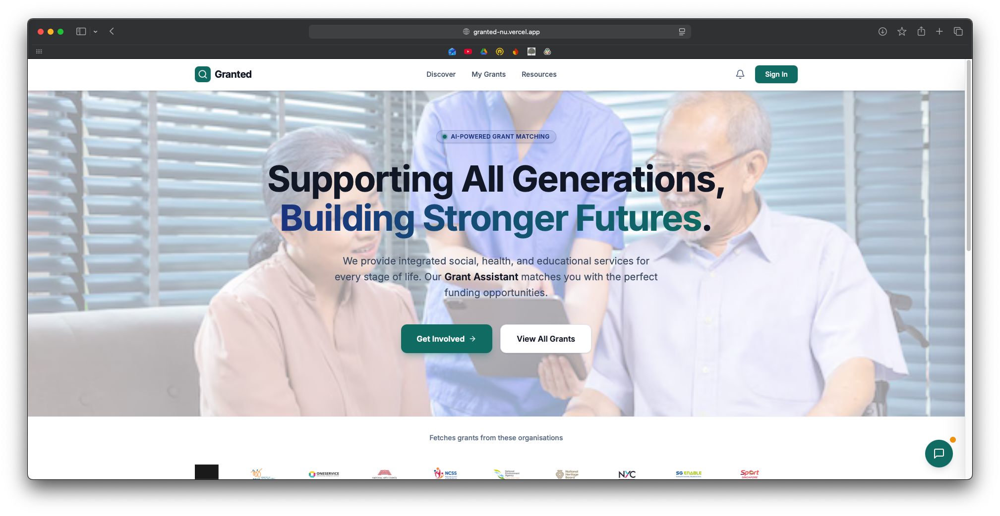

# Granted — Hackathon Project & Developer Guide



## Hackathon Project — Overview

This repository contains the Hackathon entry for "Granted": an automated grant discovery engine built to help NPOs find and act on funding opportunities.

### Inspiration

We wanted to build a system where funding finds the NPO, shifting the paradigm from "Pull" (active checking) to "Push" (proactive notification).

### Problem Statement

How might non-profit organisations "pull" information about grants from the OurSG grants portal that are relevant to them according to key criteria including issue area, scope of grant, KPIs, funding quantum, application due date, etc., so that they can strengthen their financial sustainability?

### What it does

- **Grant Discovery**: Browse and search through available grants from OurSG with real-time filtering by category, eligibility, and funding amount.
- **AI-Powered Assistant**: Chat with an intelligent assistant to get help finding relevant grants, understanding requirements, and refining your search.
- **Smart Matching**: Automated matching engine that analyzes NPO profiles against grant criteria using vector embeddings and intelligent scoring.
- **Saved Grants**: Bookmark grants of interest and track them in a personalized dashboard.
- **Email Notifications**: Receive automated email digests with matched grants, including grant details, deadlines, and application links.
- **NPO Profile Management**: Create and manage organization profiles with mission, budget, focus areas, and KPIs for better matching.

### Tech Stack

- **Frontend**: Vite + React + TypeScript + Tailwind CSS + Vercel
- **Backend**: Firebase Cloud Functions + Python SDK
- **Database**: Firestore (NoSQL; storing NPO, Grants, & Match Information)
- **AI/LLM**: OpenAI GPT-4o for chat interactions and grant matching
- **Authentication**: Firebase Auth

### Challenges

- Data unstructuredness: transforming conversational text into structured fields (e.g., "Average Project Budget") required iterative LLM tuning.
- Balancing relevance vs. noise: refined scoring logic to avoid spamming users and focus on high-confidence matches.
- Real-time reliability: building a robust delta-detection mechanism for the OurSG portal with minimal false positives.

### Accomplishments

- Built a push-based automation where new grants can trigger tailored emails to matched NPOs.
- Implemented a deadline-proximity boost to reduce missed deadlines.
- Replaced generic forms with an interactive conversational UX that produces structured profiles.

### What's next

- Automated drafting: help NPOs generate first-draft proposals from stored profiles.
- Multi-source aggregation: expand monitoring to corporate and private philanthropy.
- Feedback loop: allow NPOs to rate matches to refine vector embeddings and recommendation quality.

---

## Developer Guide (Quick)

This project combines a React + TypeScript frontend and a Python backend (serverless functions included). Use the sections below to run the project locally.

### Quick Overview

- **Frontend:** `frontend/` (Vite + React + TypeScript)
- **Backend:** `backend/` (Python)
- **Cloud Functions:** `backend/functions/`

### Prerequisites

- Node.js (LTS recommended) — verify with `node -v`
- npm (comes with Node) — verify with `npm -v`
- Python 3.10+ — verify with `python3 --version`
- Git — verify with `git --version`

### Setup (repo root)

Clone and open the repository:

```bash
git clone https://github.com/ClarenceChoo/Granted.git
cd Granted
```

### Frontend — Run locally

1. Change into the `frontend` folder and install dependencies:

```bash
cd frontend
npm install
```

2. Start the dev server:

```bash
npm run dev
```

3. Open the local URL shown in the terminal (default: http://localhost:5173).

Common commands (from `frontend/`):

- `npm run dev` — start dev server
- `npm run build` — build production bundle
- `npm run lint` — run linters

### Backend — Run locally (Python)

1. Create and activate a virtual environment from the repo root (recommended):

```bash
python3 -m venv .venv
source .venv/bin/activate
```

2. Install backend requirements:

```bash
pip install -r backend/requirements.txt
```

3. Run the backend server (adjust to your runner):

```bash
python backend/main.py
```

If your backend uses `uvicorn`/`gunicorn`/`flask` adapt the command accordingly.

### Email Notification System

The project uses Firebase's **firestore-send-email** extension to automatically send grant notifications to NPOs:

**How it works:**

1. When matches are created, the system adds email documents to the Firestore `mail` collection
2. The Firebase extension monitors this collection and sends emails automatically
3. Email templates are stored in `backend/functions/template/` and rendered with grant data

**Email Features:**

- Mobile-responsive HTML templates with grant details
- Personalized recipient information
- Direct links to grant details and application pages
- Automatic tracking of email delivery status

**Configuration:**

- Extension settings: `backend/extensions/firestore-send-email.env`
- Email templates: `backend/functions/template/email_template_updated.html`
- Test emails: Use the `EmailTester` component in the frontend (`frontend/src/components/features/email/EmailTester.tsx`)

**Handlers:**

- `send_email.py` - Manual email sending endpoint
- `send_grant_emails.py` - Automated grant notification emails

### Cloud Functions

Serverless handlers live in `backend/functions/`. See `backend/functions/requirements.txt` and `backend/functions/main.py` for details.

### Project Structure

```txt
Granted/
├── frontend/
│   ├── src/
│   │   ├── components/
│   │   │   ├── features/
│   │   │   │   ├── chat/
│   │   │   │   ├── email/
│   │   │   │   └── grants/
│   │   │   └── layout/
│   │   ├── contexts/
│   │   ├── pages/
│   │   ├── services/
│   │   ├── utils/
│   │   ├── App.tsx
│   │   ├── firebase.ts
│   │   └── types.ts
│   ├── public/
│   ├── package.json
│   ├── vite.config.ts
│   ├── vercel.json
│   └── eslint.config.js
├── backend/
│   ├── functions/
│   │   ├── handlers/
│   │   │   ├── ai/
│   │   │   ├── grants/
│   │   │   ├── matching/
│   │   │   ├── npo/
│   │   │   └── saved_grants/
│   │   ├── services/
│   │   ├── template/
│   │   ├── tests/
│   │   ├── utils/
│   │   ├── main.py
│   │   ├── requirements.txt
│   │   └── pytest.ini
│   ├── extensions/
│   ├── firebase.json
│   ├── firestore.rules
│   ├── firestore.indexes.json
│   ├── pyproject.toml
│   └── sample.env
├── assets/
└── README.md
```

### Notes & Troubleshooting

- If ports are occupied, the dev servers will usually try a different port — check the terminal output.
- If you hit dependency issues, recreate the environment (`.venv`) and reinstall packages.
- For frontend build issues, delete `node_modules` and `package-lock.json`, then run `npm install`.

### Contributing

- Open an issue for new feature requests or bugs.
- Create small, focused pull requests.

### Connect with Us

- Anson Ng (Frontend Engineer/Product Manager) - [linkedin](https://www.linkedin.com/in/iiansonng/)
- Clarence Choo (Frontend Engineer/UIUX Designer) - [linkedin](https://www.linkedin.com/in/clarence-choo/)
- Tan Yu Hoe (Backend Engineer/Database Administrator) - [linkedin](https://www.linkedin.com/in/yu-hoe-tan/)
- Lionel Zheng (Material Scientist) - [linkedin](https://www.linkedin.com/in/lionel-zheng-06a5b9303/)
